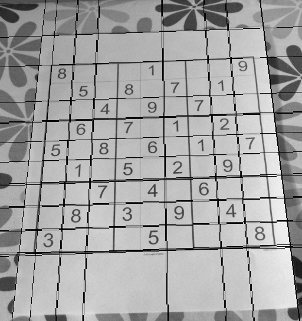

# Line Detection with Hough Transform (Python implementation w/out the built-in libraries)

Hough Transform (HT) was used to detect the lines from 3 input images. HT was implemented from scratch with the only exception to use OpenCV Canny Edge Detection for the edge image. A complete edge image is essential for the HT. Therefore, thresholds for hysteresis procedure are important when using the Canny. Overall, the lines were detected with a good accuracy. However, the built-in library is performing slightly better. The centre line of the football pitch (Im02.jpg) couldn't be detected with this implementation.

### Example output

